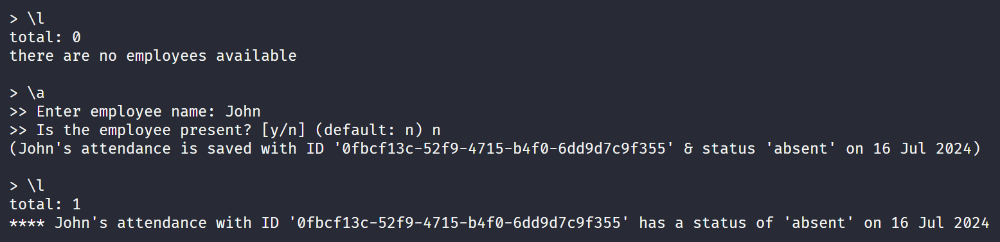

<div align="center">
  <br>
  <h1>AMA</h1>
  <p>🙋 A simple attendance manager CLI app 🙋</p>
  <br>
</div>

## Table of Contents

- [Description](#description)
- [Minimum Requirements](#minimum-requirements)
- [Usage](#usage)
- [Screenshots](#screenshots)

## Description

[`^ back to top ^`](#table-of-contents)

**AMA** is a simple CLI app to manage employee attendance. The app is made with Go. It is created for the final project in the Go phase of the Backend Development Training.

## Minimum Requirements

[`^ back to top ^`](#table-of-contents)

- Show list of employees and their presence status.
- Add a new employee to the presence list.
- Update presence status (true/ present or false/ absent).
- Delete an employee from the presence list.
- Use map or slice to store employees data.
- Each employee has ID, name, & presence status (boolean).
- Use pointer to access & manipulate data.

## Usage

[`^ back to top ^`](#table-of-contents)

- Start the app.

  ```bash
  go run ./cmd/app
  ```

- Enter a command.

  Choose one of these commands:

  ```bash
  \l                              => Get list of employees
  \a                              => Add a new employee
  \u [employee-id] [status (y/n)] => Update employee presence status
  \d [employee-id]                => Delete an employee
  \c                              => Show all commands
  \q                              => Quit
  ```

## Screenshots

### Show list of employees & add a new employee



### Update presence status


### Delete an employee


